# PustakaDesk 📚

Sistem Manajemen Perpustakaan berbasis **PySide6 + SQLite**  
Tugas Akhir Pemrograman Visual — Semester Genap 2025/2026

---

## Anggota Kelompok

| Nama | NIM | Bagian |
|------|-----|--------|
| Raffi Fatthoni | F1D02310133 | main.py, database/db_buku.py, logic/logic.py, style/style.qss, style/style_dark.qss, ui/ui_login.py, ui/ui_register.py, ui/ui_main.py, ui/auth_widgets.py, requirements.txt |
| Deswita Salsabila | F1D02410004 | ui_member.py, ui_peminjaman.py, ui_laporan.py, utils/export.py |
| Oktora Rizka Arifin | F1D02410145 | ui_buku.py, ui_user.py, ui_dashboard.py |

---

## Cara Menjalankan

```bash
# 1. Clone repository
git clone https://github.com/[username]/pv26-finalproject-pustakaDesk.git
cd pv26-finalproject-pustakaDesk

# 2. Install dependensi
pip install -r requirements.txt

# 3. Jalankan aplikasi
python main.py
```

**Akun default:**  
- Username: `admin` | Password: `admin123` (role: admin)  
- Username: `budi`  | Password: `budi123`  (role: anggota)

---

## Fitur

-  Login + manajemen sesi (role: admin / anggota)
-  Role-based interface: admin memakai UI operasional, anggota memakai portal katalog
-  Katalog buku (CRUD + search + filter kategori + sort)
-  Manajemen anggota (khusus admin)
-  Peminjaman & pengembalian buku
-   Kalkulasi denda otomatis (Rp 1.000/hari terlambat)
-  Dashboard ringkasan + chart distribusi kategori
-  Ekspor laporan ke CSV dan PDF
-  Tema gelap / terang

---

## Screenshot

# Standar
1. Login
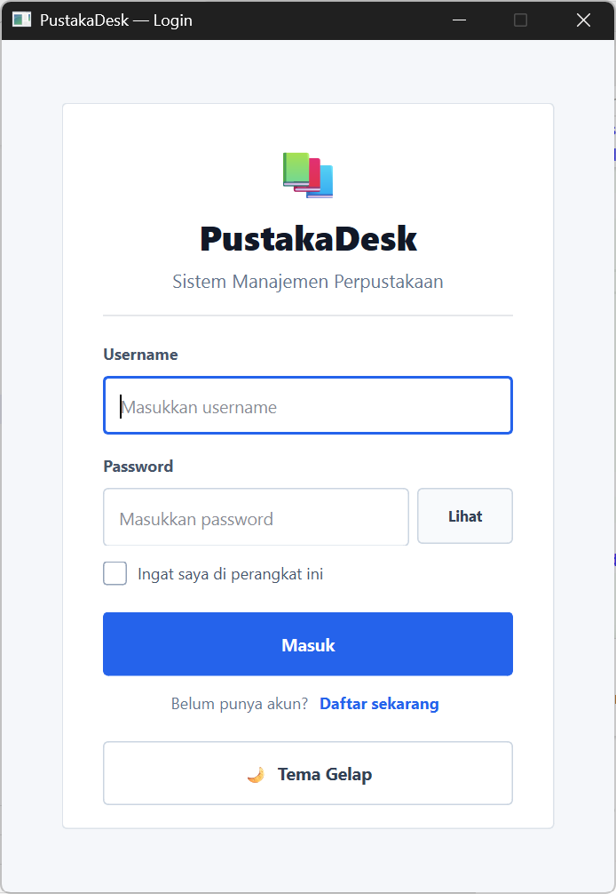

2. Register
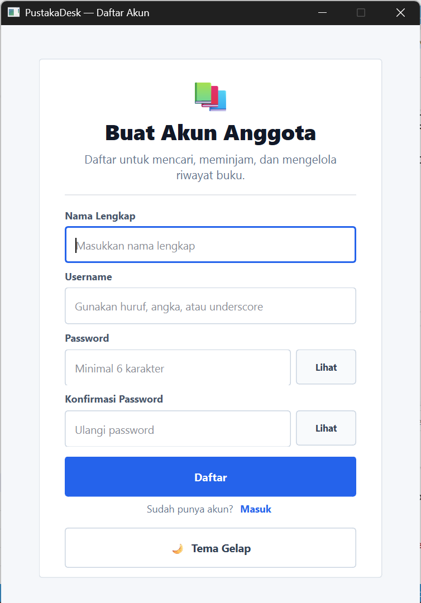

# Admin
3. Dashboard Admin
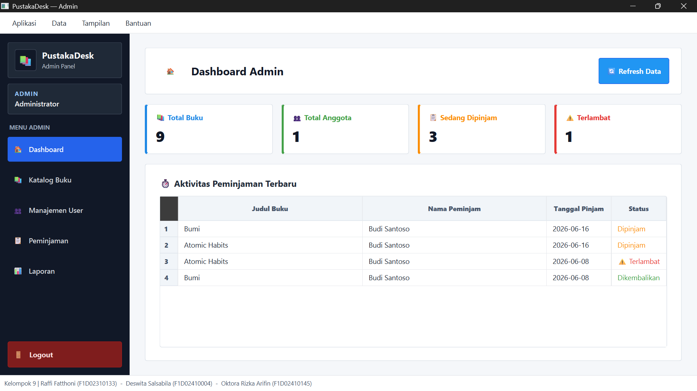

4. Katalog Admin
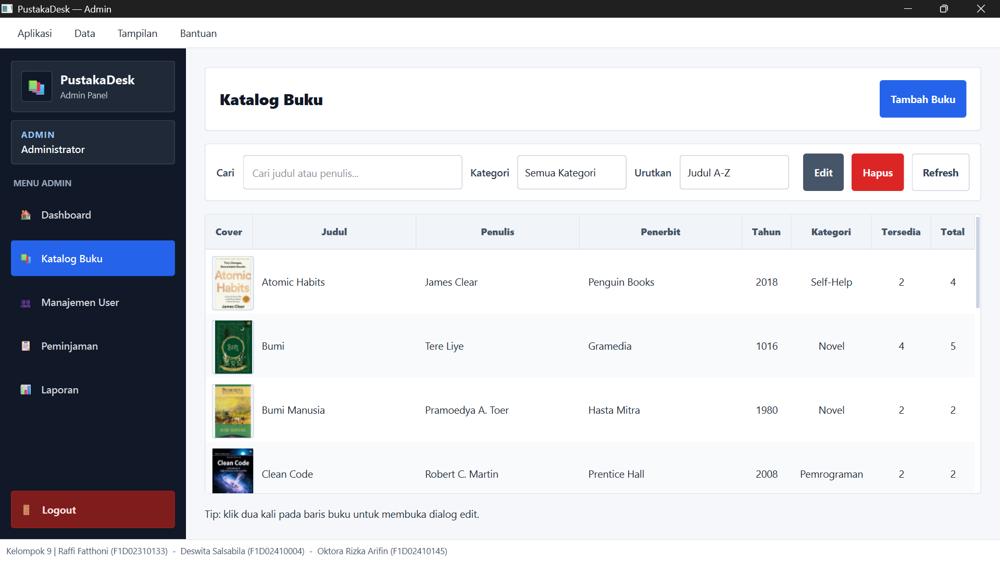

5. Manajemen User
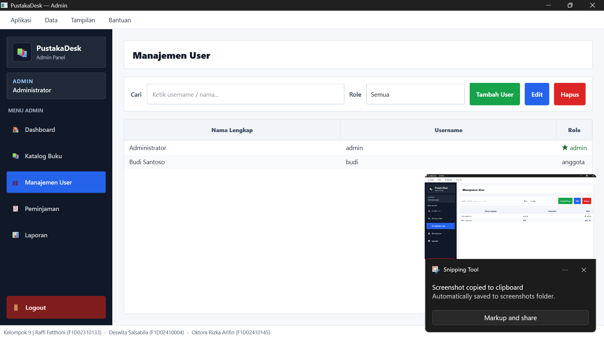

6. Manajemen Peminjaman
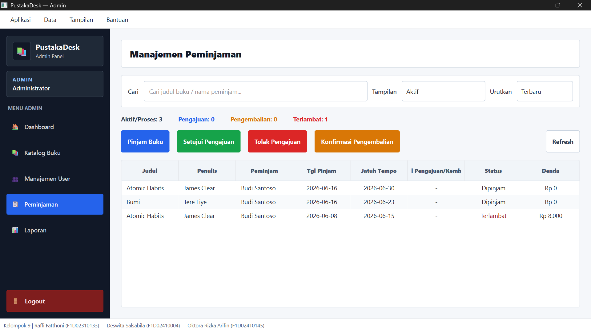

7. Laporan
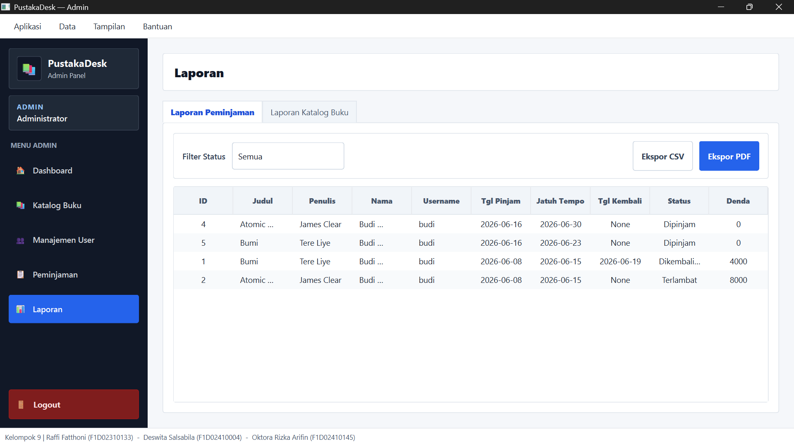

# User Peminjam
8. Beranda / Home
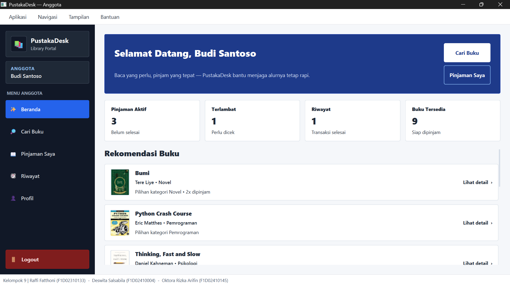

9. Kumpulan Buku
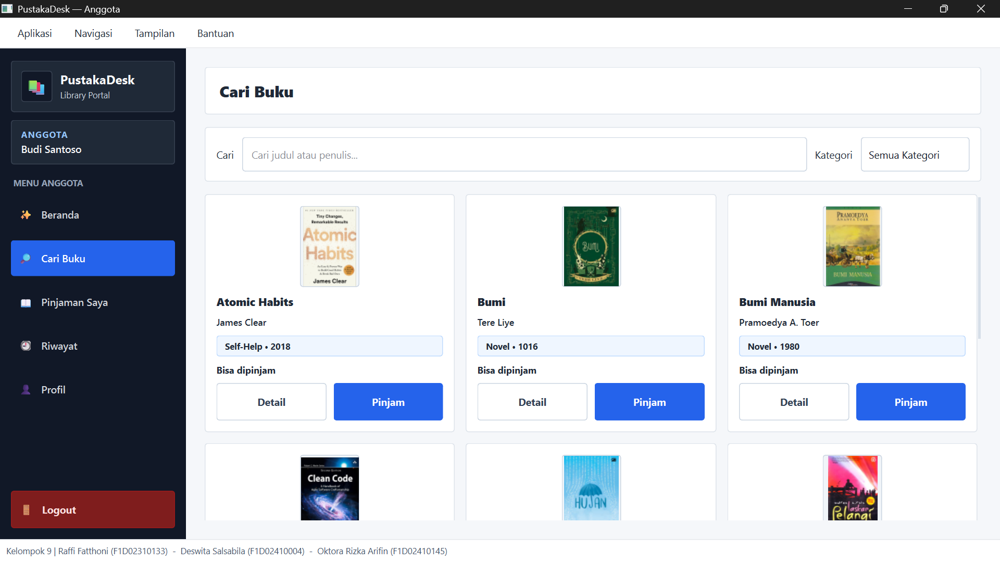

10. Pinjaman Aktif
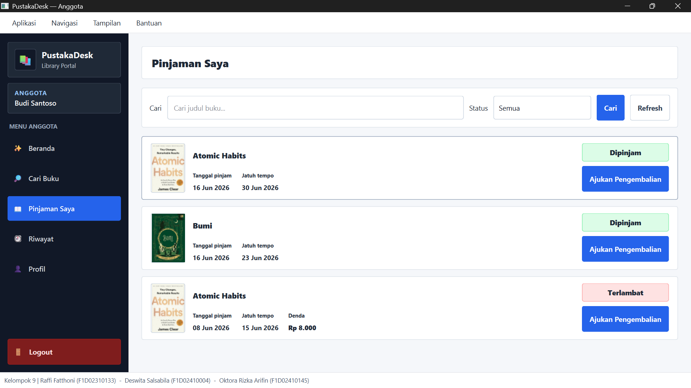

11. Riwatat Pinjaman
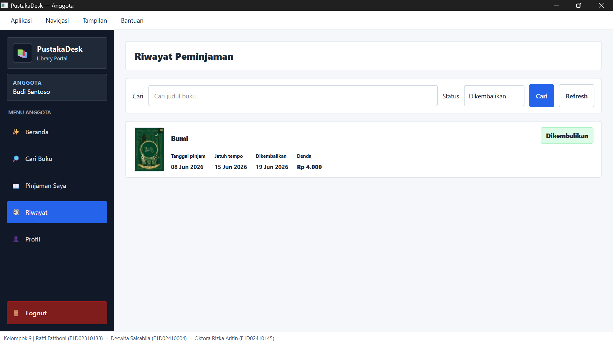

12. Profil
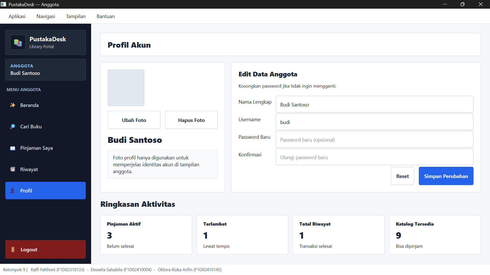
---

## Struktur Project

```
PustakaDesk/
├── database/       → db_buku.py (SQLite CRUD)
├── logic/          → logic.py (validasi, kalkulasi)
├── style/          → style.qss / style_dark.qss
├── ui/             → semua halaman UI
│   └── ui_member.py → halaman khusus anggota/peminjam
├── utils/          → export CSV + PDF
└── main.py         → entry point
```
